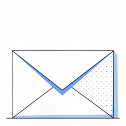

<div align="center">



<h1>Crypto Mail</h1>

A public messaging system running on the blockchain

</div>

---

This smart contract is designed to provide a public mail system focused on communication between institutions and companies. The idea behind this project is to increase transparency and information in the market, thus avoiding decision-making under the shadows.

The use of blockchain technology makes it possible to guarantee the security and privacy of the data, which is especially important in a public mail system where confidentiality is key. In addition, Solana's ability to handle large volumes of transactions per second ensures the scalability necessary for this system to be effective in an enterprise environment.

My goal in sharing this repository is so that other developers and companies can build and improve this public mail system to better suit their specific needs. I believe that these types of solutions are essential to promote transparency and access to information, which in turn can foster a fairer and more equitable economy. I hope you find this project interesting and useful!

<h3 align="center">Init an account in the mail system</h3>

```rust
pub fn init_crypto_mail(
    ctx: Context<InitCryptoMail>,
) -> Result<()> {
    let account: &mut Account<MailAccount> = &mut ctx.accounts.account;
    let (_pda, bump) = Pubkey::find_program_address(&[ctx.accounts.user.key().as_ref()], ctx.program_id);
    account.bump_original = bump;
    account.pubkey = ctx.accounts.user.key();
    Ok(())
}

#[derive(Accounts)]
pub struct InitCryptoMail<'info> {
    #[account(init, seeds = [user.key().as_ref()], bump, payer = user, space = 8 + MailAccount::SIZE)]
    pub account: Account<'info, MailAccount>,
    #[account(mut)]
    pub user: Signer<'info>,
    pub system_program: Program<'info, System>,
}
```

The init_crypto_mail function takes as argument a ctx context of type Context<InitCryptoMail>. This function initializes a crypto mail account and associates it with the user's account.

First, a mutable reference to the email account (account) is obtained using the Accounts structure. Then, the find_program_address method of the Pubkey structure is used to generate a user-derived public key that will be used as a seed to initialize the mail account. The ctx.program_id parameter represents the public key of the program on the Solana blockchain.

Next, the bump_original field of the email account is set to the value of the bump generated by find_program_address, and the pubkey field is set to the public key of the user's account. Finally, the function returns Ok(()). The InitCryptoMail structure is an account type that is used to initialize a crypto mail account. The fields in this structure represent the Solana accounts needed to create the email account, including the email account itself, the user account, and the Solana system program.

The Accounts structure is used to define a list of accounts that are required for the init_crypto_mail function. This list is used to ensure that the necessary accounts are available in the context of the role.

<h3 align="center">Send a mail</h3>

```rust
pub fn send_mail(
    ctx: Context<SendMail>,
    mail: String,
    len: u16,
) -> Result<()> {
    let (_pda, bump) = Pubkey::find_program_address(&[ctx.accounts.user.key().as_ref()], ctx.program_id);
    require!(mail.len() <= 9923, ErrorCode::LenghtError);
    require!(ctx.accounts.sender.pubkey.key() == ctx.accounts.user.key(), ErrorCode::PubkeyError);
    let mail: &mut Account<Mail> = &mut ctx.accounts.account;
    mail.bump_original = bump;
    mail.receiver = ctx.accounts.receiver.key();
    mail.sender = ctx.account.user.key();
    Ok(())
}

#[derive(Accounts)]
#[instruction(len: u16)]
pub struct SendMail<'info> {
    #[account(init, seeds = [
        user.key().to_bytes().as_ref(),
        receiver.key().to_bytes().as_ref(),
        ], bump, payer = user, space = 8 + 4 + len as usize)]
    pub mail: Account<'info, Mail>,
    #[account(mut, seeds = [sender.pubkey.key().as_ref()], bump = sender.bump_original)]
    pub sender: Account<'info, MailAccount>,
    #[account(mut, seeds = [receiver.pubkey.key().as_ref()], bump = receiver.bump_original)]
    pub receiver: Account<'info, MailAccount>,
    #[account(mut)]
    pub user: Signer<'info>,
    pub system_program: Program<'info, System>,
}
```

The send_mail function takes three arguments: ctx which is the execution context, mail which is a string representing the email to send, and len which is a 16-bit unsigned integer representing the length of the email.

The function uses the Solana Rust SDK library and defines a structure called SendMail with five fields tagged with attributes. The fields are "mail" which is a Solana account that contains the email data, "sender" and "receiver" which are Solana accounts that represent the address of the sender and the recipient, respectively, "user" which is a Solana account that represents the user who sends the email, and "system_program" which is a Solana object that represents the system program.

The function uses the find_program_address function from the Solana Rust SDK library to find the public program address and bump number for the email account mail. The function then verifies that the length of the email is less than or equal to 9923 and that the sender's public key is the same as the user sending the email.

Finally, the function updates the fields for the email account mail and returns an Ok(()) result if the update was successful. In particular, the function sets the original bump number of the email account mail to bump, sets the recipient's public key to receiver.key() and sets the sender's public key to ctx.account.user.key() .
